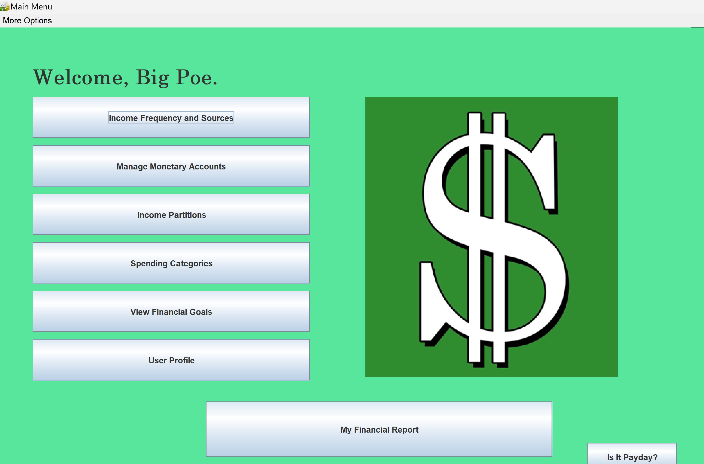
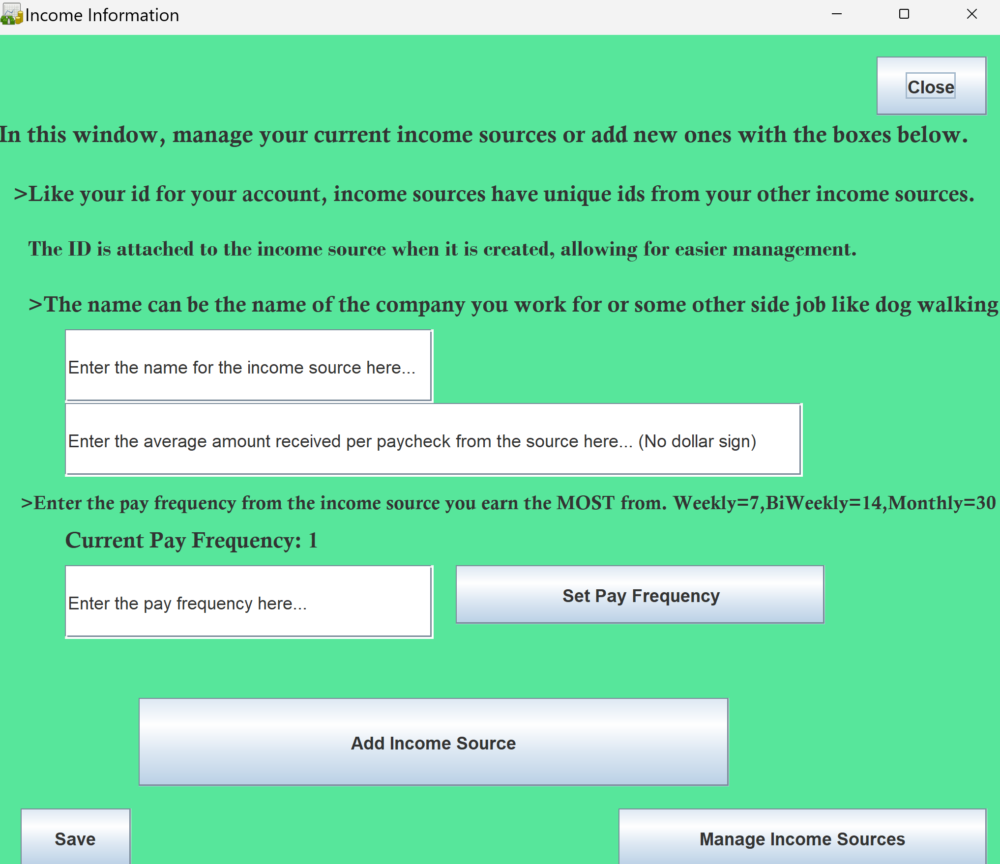
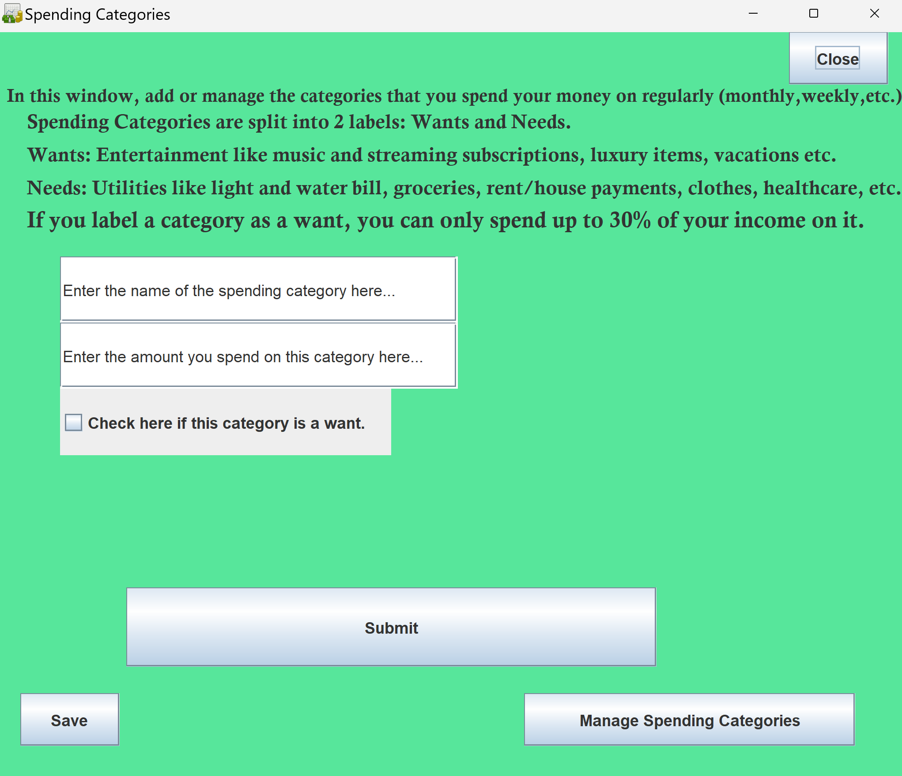
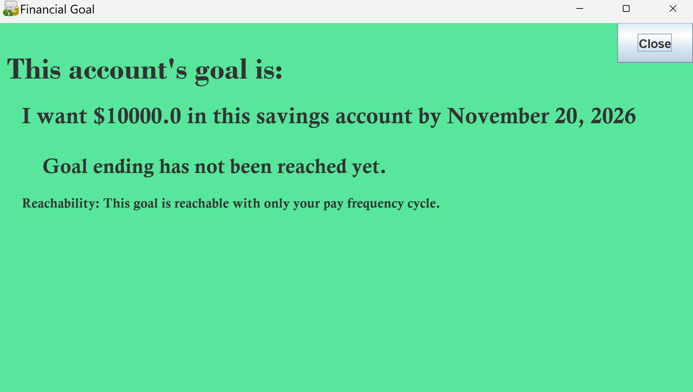

# BudgetingApplication

A full desktop budgeting tool built in Java Swing as my first complete application during the early stages of my software development journey. This project represents the foundation of my growth as a developer — from learning UI components to structuring multi‑class applications and handling real user input.

## Overview
Budgeting Application allows users to track income sources, spending categories, savings goals, and financial partitions through an interactive multi‑window interface. The application uses Java Swing for all UI elements and demonstrates event‑driven programming, input validation, and basic data management.

## Features
- Multi‑window interface built with Java Swing
- Add and manage income sources
- Add and categorize spending entries
- Track savings goals and financial partitions
- Radio buttons, text fields, dialogs, and frames for user interaction
- Input validation and error handling
- Simple reporting screens for income, spending, and goals

## Purpose
This project was intentionally kept in its original state as a reminder of my beginnings in software development. It showcases my early understanding of UI design, object‑oriented programming, and application structure. While not intended for further development, it serves as a milestone in my learning journey and a demonstration of my ability to build and complete a functional desktop application.

## Screenshots

### Home Screen

### Income Entry

### Spending Categories

### Goals Tracking

## How to Run
Compile and run using the Java compiler:
javac yourpackage/*.java
java yourpackage.Application

## Notes
This project is provided without a license and is intended solely as a portfolio piece. All rights reserved.
